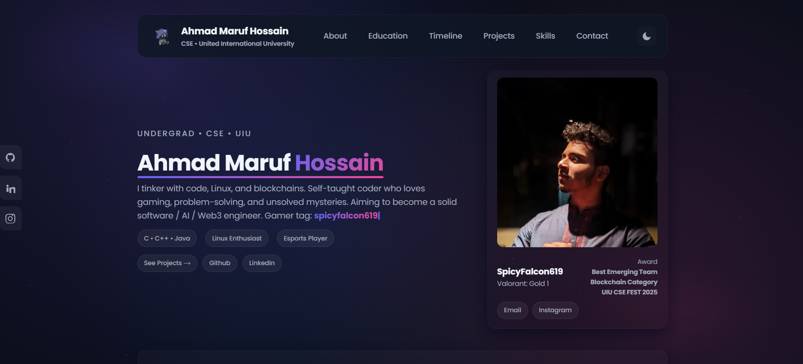

# My Portfolio

Hey there! 👋 I'm Maruf Hossain, and this is my personal portfolio website built with **Next.js**, **TypeScript**, and **Tailwind CSS**.

This project showcases my skills, projects, and design style-all in one sleek, responsive web app.

---

## 🌐 Live Demo

Check out the live site: [https://spicyfalcon-portfolio.vercel.app](https://spicyfalcon-portfolio.vercel.app)

---

## 🛠 Tech Stack

* **Framework**: Next.js
* **Language**: TypeScript
* **Styling**: Tailwind CSS
* **Deployment**: Vercel
* **Linting/Formatting**: ESLint, Prettier

---


## 📂 Project Structure

```
my-portfolio/
├── public/
│   ├── file.svg
│   ├── globe.svg
│   ├── next.svg
│   ├── vercel.svg
│   ├── window.svg
│   └── assets/
│       ├── android-chrome-192x192.png
│       ├── android-chrome-512x512.png
│       ├── apple-touch-icon.png
│       ├── avatar-t.jpg
│       ├── avatar.jpg
│       ├── favicon-16x16.png
│       ├── favicon-32x32.png
│       ├── my-logo.png
│       └── preview.png
├── src/
│   ├── app/
│   │   ├── favicon.ico
│   │   ├── globals.css
│   │   ├── layout.tsx
│   │   ├── page.module.css
│   │   └── page.tsx
│   └── components/
│       ├── ClientEffects.tsx
│       └── ProjectCard.tsx
├── plain-html/
│   ├── index.html
│   ├── style.css
│   └── script.js
├── eslint.config.mjs
├── next-env.d.ts
├── next.config.ts
├── package.json
├── README.md
├── tsconfig.json
```


## Screenshots



---

## ⚡ Features

* Fully responsive and mobile-friendly design
* Smooth animations and interactive UI elements
* Dark/light mode support
* Easy to extend with new projects or sections

---

## 🚀 Getting Started

### Prerequisites

* Node.js >= 18
* npm or yarn


### Installation

```bash
npm install
npm run dev
# or
yarn
yarn dev
```

Open [http://localhost:3000](http://localhost:3000) in your browser to see it live locally.

### Build for Production

```bash
npm run build
npm start
```

---

## 📈 Deployment

This project is optimized for **Vercel**. Simply connect your GitHub repo to Vercel and it will auto-deploy on each push.

---

## 💡 Contributing

Feel free to fork this repo and make improvements! Pull requests are welcome.

---

## 📝 License

This project is **open source** and available under the MIT License.
