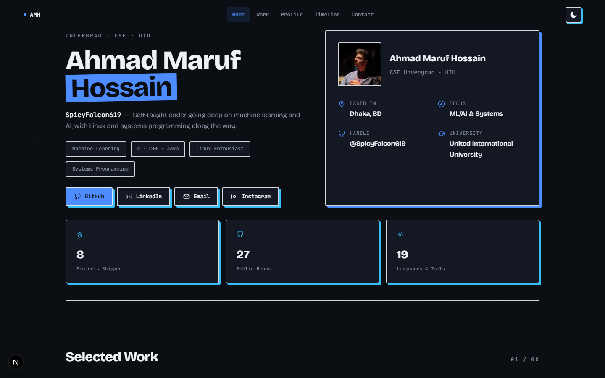

# Ahmad Maruf Hossain — Portfolio

Personal portfolio for **SpicyFalcon619** — a CSE undergrad at United International University going deep on machine learning and AI, with systems programming and Linux along the way. Built as a neo-brutalist single-page site: solid panels, hard offset shadows, sharp corners, real GitHub data — no stock templates, no placeholder content.

**Live:** [spicyfalcon-portfolio.vercel.app](https://spicyfalcon-portfolio.vercel.app)



---

## Tech Stack

* **Framework**: Next.js 15 (App Router), React 19, TypeScript
* **Styling**: Plain CSS with custom properties for theming — no utility framework
* **Animation**: Framer Motion, `react-type-animation`
* **Theming**: `next-themes` (dark/light, class-based)
* **Analytics**: Vercel Analytics + Speed Insights
* **Deployment**: Vercel

## What Makes This Different

* **Real GitHub data, not placeholders** — [`src/lib/github.ts`](src/lib/github.ts) fetches live public-repo stats from the GitHub REST API and scrapes the actual contribution calendar HTML from `github.com/users/{user}/contributions`, then renders it as a self-owned CSS grid (no third-party chart embeds).
* **8 real, linked projects** — every entry in Selected Work links to an actual repo or live deployment, not a tutorial clone.
* **Pure neo-brutalism** — solid panel backgrounds, 2px borders, hard (no-blur) offset shadows, minimal border-radius, and project rows styled as literal pressable buttons.
* **Minimal custom cursor** — a small brutalist arrow with a hard offset shadow replaces the native pointer everywhere, including over text; automatically disabled on touch devices.
* **No glassmorphism, no generic bento grids, no background particle effects** — deliberately avoided after early iterations read as generic/AI-templated.
* **Mobile-first nav** — the sticky top bar collapses into a slide-down menu below 760px instead of just disappearing.

## Project Structure

```
my-portfolio/
├── public/
│   └── assets/            # avatar, favicons, preview screenshot
├── src/
│   ├── app/
│   │   ├── globals.css    # design tokens + all styling
│   │   ├── layout.tsx     # fonts, theme provider, analytics
│   │   └── page.tsx       # fetches GitHub data, composes sections
│   ├── components/
│   │   ├── TopBar.tsx          # sticky nav + mobile menu
│   │   ├── Hero.tsx             # name, tagline, profile card, stats
│   │   ├── ProjectIndex.tsx     # Selected Work — index + detail view
│   │   ├── InfoPanels.tsx       # About, Tech Stack, GitHub activity
│   │   ├── GitHubHeatmap.tsx    # renders real contribution data
│   │   ├── Timeline.tsx         # education + achievements
│   │   ├── ContactCTA.tsx       # contact form + socials
│   │   ├── Icons.tsx            # custom SVG icon set
│   │   ├── ThemeToggle.tsx
│   │   ├── ScrollReveal.tsx
│   │   ├── MagneticButton.tsx
│   │   ├── CustomCursor.tsx
│   │   └── ClientEffects.tsx   # mounts client-only effects in layout.tsx
│   └── lib/
│       └── github.ts      # GitHub REST fetch + contribution scraper
├── next.config.ts
├── package.json
└── tsconfig.json
```

## Getting Started

### Prerequisites

* Node.js >= 18
* npm

### Installation

```bash
npm install
npm run dev
```

Open [http://localhost:3000](http://localhost:3000) to see it live locally.

### Build for Production

```bash
npm run build
npm start
```

## Deployment

Optimized for **Vercel** — connect the GitHub repo and it auto-deploys on every push to `main`.

## Roadmap

See [NEXT_STEPS.md](NEXT_STEPS.md) for the open ideas backlog (OG image, resume link, deeper case studies, perf pass).

## License

Open source under the MIT License.
